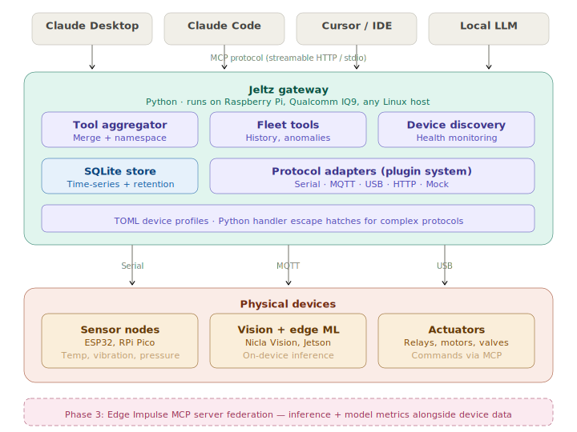

# Jeltz

> **Status: Phase 1 complete.** Gateway core, CLI, serial + MQTT adapters, fleet-level tools, SQLite time-series storage, daemon mode with background recording, and built-in profiles — all working. 305 tests passing. See the [Getting Started guide](docs/getting-started.md) to try it.

**Your sensors will be processed.**

Jeltz is an open source framework that connects AI assistants to physical devices — sensors, actuators, cameras, and edge ML boards — via the [Model Context Protocol](https://modelcontextprotocol.io/) (MCP).

Write a TOML profile describing your hardware. Jeltz generates an MCP server. Plug in your device. Now any MCP client can reason across your entire sensor fleet.

```
$ jeltz start -p profiles
✓ Discovered 3 device(s), exposing 15 tools
  ✓ serial_sensor
  ✓ mqtt_sensor
  ✓ pressure_line
✓ MCP server ready on stdio
```

A dashboard shows you numbers. Jeltz lets an LLM *reason about what they mean*:

```
You: Anything weird going on?

LLM: Mostly nominal, but two things worth attention:

1. Tanks 2 and 5 are both climbing at 0.3°C/hr, but tank 5
   started rising 40 minutes after tank 2. They share glycol
   loop B — this looks like a chiller issue, not individual
   tank problems. I'd check the loop B circulation pump.

2. The humidity sensor in Bay 6 has been flatlined at exactly
   45.0% for 9 hours. That's almost certainly a stuck sensor,
   not perfect stability. Recommend recalibration.

Everything else is within baseline.
```

That's cross-device correlation, anomaly interpretation, and root cause inference — the stuff a Grafana panel can't do.

## Why Jeltz exists

Dashboards show you numbers. They require you to know which panel to look at, already suspect something is wrong, and manually correlate across devices. Jeltz gives your sensor fleet a voice.

The MCP ecosystem has hundreds of integrations for SaaS tools — Slack, GitHub, databases, APIs. But nothing for the physical world. Meanwhile, the people with the most data (factories, labs, breweries, farms) are the ones with the least tooling to make sense of it.

Jeltz fixes this by making physical devices first-class participants in the MCP ecosystem. The value isn't "read a sensor value in English" — it's what an LLM can do when it has access to *all* your devices at once:

- **Cross-device reasoning.** Correlate readings across sensors to identify shared root causes (failing chiller, not individual tank problems).
- **Anomaly interpretation.** Not just "this number is red" — but *why* it's anomalous and what it probably means (stuck sensor vs real reading, bearing wear vs imbalance).
- **Multi-step investigation.** "Check all sensors on Line 4, find any drifting from their 30-day baseline, and tell me if the drift correlates with the ambient temp sensor." One sentence, 45 minutes of manual work eliminated.
- **Proactive insight.** An operator who says "anything weird?" gets answers about devices they weren't thinking to check.

## How it works

Jeltz runs on a gateway device (Raspberry Pi, laptop, Qualcomm IQ9, any Linux box). It connects to your physical devices over their native protocols (serial, MQTT, USB, HTTP) and exposes them as MCP tools through a single unified endpoint.



**The AI stays in the cloud (or on a local LLM). Jeltz is just the plumbing that connects it to your devices.** An MCP server is not an AI model — it's a lightweight protocol endpoint. It uses negligible resources on the gateway.

## Adding devices

### TOML profiles

Write a TOML file that describes the device: what it is, how to connect, and what commands it understands. Jeltz generates MCP tools from it.

```toml
[device]
name = "fermentation_temps"
description = "Temperature monitoring for 6 fermentation tanks"

[connection]
protocol = "serial"
port = "/dev/ttyUSB0"
baud_rate = 115200
timeout_ms = 3000

[[tools]]
name = "get_reading"
description = "Get current temperature for a specific tank"
command = "READ_TEMP {tank_index}"

[tools.params.tank_index]
type = "int"
min = 0
max = 5

[tools.returns]
type = "float"
unit = "celsius"

[health]
check_command = "PING"
expected = "PONG"
interval_ms = 10000
```

```
$ jeltz add-device fermentation_temps.toml
✓ Added fermentation_temps (profiles/fermentation_temps.toml)

$ jeltz test profiles/fermentation_temps.toml
Device:   fermentation_temps
Protocol: serial
Tools:    1
✓ Connected
✓ Health check passed
✓ Disconnected
```

The device firmware just needs to accept text commands over serial (or MQTT) and respond with plain text. See the [built-in profiles](profiles/) for complete firmware examples.

### Self-describing devices (Phase 2)

The `jeltz-arduino` C++ library will let devices self-describe to the gateway — no TOML profile needed. Register tools in firmware, plug in the device, and the gateway discovers it automatically.

## Built-in profiles

Jeltz ships with profiles for common setups. Each includes wiring diagrams and complete firmware examples you can flash:

| Profile | Protocol | Description |
|---------|----------|-------------|
| [`serial_sensor`](profiles/serial_sensor.toml) | Serial | Any microcontroller with a text command protocol over USB serial |
| [`mqtt_sensor`](profiles/mqtt_sensor.toml) | MQTT | Any WiFi device publishing sensor data over MQTT |

These profiles use temperature + humidity as an example, but the commands and return types are easily adapted to any sensor.

## Installation

```bash
git clone https://github.com/hhheath/jeltz.git
cd jeltz
pip install -e .
```

Requires Python 3.11+.

## Quickstart

For a full walkthrough (wiring, firmware, MCP client setup), see the **[Getting Started guide](docs/getting-started.md)**.

Quick version:

```bash
# Copy a built-in profile into your working directory
mkdir profiles
cp jeltz/profiles/serial_sensor.toml profiles/

# Edit the profile — set your serial port, adjust commands if needed
# (or use it as-is with the example firmware from the profile comments)

# Test the device connection
jeltz test profiles/serial_sensor.toml

# Check what the gateway sees
jeltz status -p profiles

# Start the MCP server
jeltz start -p profiles
```

Then add Jeltz to your MCP client. For Claude Desktop or Claude Code:

**Stdio mode** (client manages the process):
```json
{
  "mcpServers": {
    "jeltz": {
      "command": "jeltz",
      "args": ["start", "-p", "/path/to/your/profiles"]
    }
  }
}
```

**Daemon mode** (connect to a running `jeltz daemon`):
```json
{
  "mcpServers": {
    "jeltz": {
      "url": "http://localhost:8374/mcp"
    }
  }
}
```

## CLI

```bash
jeltz start -p profiles      # Start the MCP gateway (stdio transport)
jeltz daemon -p profiles     # Long-running daemon: background recording + HTTP
jeltz status -p profiles     # Show connected devices and health
jeltz test <profile.toml>    # Test a single device connection
jeltz add-device <file.toml> # Validate and copy a profile into profiles/
```

### `start` vs `daemon`

**`jeltz start`** runs as a subprocess of your MCP client (Claude Desktop, Claude Code, etc.). The client manages the process lifecycle — when the client disconnects, the gateway stops. Good for development and single-client setups.

**`jeltz daemon`** runs as a long-lived process. It continuously polls sensors and records readings to the SQLite store, runs periodic retention cleanup, and serves MCP over [Streamable HTTP](https://modelcontextprotocol.io/specification/2025-06-18/basic/transports) so clients can connect and disconnect without affecting the recording loop. Use this when you want always-on monitoring with persistent history.

```bash
jeltz daemon -p profiles --host 0.0.0.0 --port 8374
```

```
✓ Discovered 3 device(s), exposing 15 tools
  ✓ serial_sensor
  ✓ mqtt_sensor
  ✓ pressure_line
✓ Background recording active
✓ MCP server ready on http://0.0.0.0:8374/mcp
```

## Use cases

**Edge AI development loop.** Deploy a model to a dev board with Edge Impulse, then use an LLM of your choice to run inference batches across 50 test samples, generate a confusion matrix, pull raw sensor data for misclassifications, and identify what additional training data you need — all in one conversation instead of a half-day manual investigation.

**Small-scale industrial monitoring.** A brewery with 6 fermentation tanks and a glycol chiller. A machine shop with vibration sensors on 4 presses. A research lab with 20 environmental monitors. Too small for Azure IoT Hub, too important for a spreadsheet. The LLM correlates across devices, interprets drift patterns, and catches the stuck sensor you wouldn't notice on a dashboard for days.

**Natural language commissioning.** "I just installed 3 new pressure sensors on the coolant lines. Run a health check on all three, verify they're reading within spec, and set alert thresholds at 15% above their current baseline." One sentence drives a multi-tool workflow: discover, read, calculate, configure.

**Air-gapped / local-first deployments.** Pair Jeltz with a local LLM (llama.cpp on a Raspberry Pi 5 or Qualcomm IQ9) for fully offline, data-sovereign AI interaction with your equipment. No cloud, no internet, no data leaving the building.

**Home automation with brains.** Bridge your DIY sensors into any MCP-compatible AI assistant. Not just "turn on the lights" — "the humidity in the basement has been climbing for 3 days and the sump pump hasn't cycled. You might have a drainage issue."

## Roadmap

- **Phase 1 (complete):** ~~Core framework~~ ✓, ~~serial adapter~~ ✓, ~~MQTT adapter~~ ✓, ~~SQLite time-series storage~~ ✓, ~~fleet-level tools~~ ✓, ~~CLI~~ ✓, ~~built-in profiles~~ ✓, ~~mock adapter~~ ✓, ~~daemon mode~~ ✓
- **Phase 2:** Modbus RTU/TCP adapter, OPC-UA adapter, community profile repository, device namespacing, actuator safety controls
- **Phase 3:** BLE adapter, CAN bus adapter, `jeltz-arduino` C++ library, USB adapter, Edge Impulse integration, event streaming
- **Phase 4:** Local LLM integration, web dashboard, alert system, IQ9 reference deployment, additional ML platform integrations

## Documentation

- **[Getting Started](docs/getting-started.md)** — full tutorial: install, wire hardware, flash firmware, connect an MCP client
- **[Writing Profiles](docs/writing-profiles.md)** — TOML profile reference: tools, parameters, return types, health checks
- **[Writing Adapters](docs/writing-adapters.md)** — how to add support for a new protocol

## Development

```bash
hatch run test        # Run tests (305 tests, mock adapter, no hardware needed)
hatch run lint        # Ruff linter
hatch run typecheck   # Mypy strict mode
```

## Contributing

Jeltz is built in public. Follow along and contribute:

- **Profiles:** The easiest way to contribute. Write a TOML profile for hardware you own, test it, submit a PR. See the [writing profiles](docs/writing-profiles.md) guide.
- **Adapters:** New protocol support. Implement the `BaseAdapter` interface for your protocol. See the [writing adapters](docs/writing-adapters.md) guide.
- **Core:** Gateway, aggregator, CLI improvements.

## Why "Jeltz"?

Named after Prostetnic Vogon Jeltz from *The Hitchhiker's Guide to the Galaxy* — the captain who processes everything, methodically, without exception. Every tool call, every sensor reading, every health check gets routed, validated, and delivered.

Your sensors will be processed.

## License

Apache 2.0
